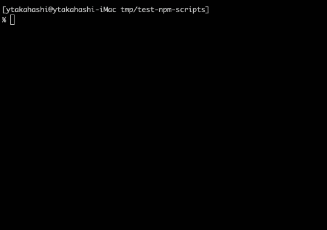

# nps

[](https://deno.land/x/nps)
[](https://github.com/ytakahashi/nps)
[](https://opensource.org/licenses/MIT)

Interactive npm-scripts runner for Node.js projects.



## Install

```terminal
deno install --allow-read --allow-run --unstable https://deno.land/x/nps@{version}/nps.ts
```

## Usage

Run following command in Node.js project.

```terminal
nps
```

### Filter npm-scripts

If an argument is provided, scripts are filtered by the value and prompt shows filtered items.  
If given value matches only one script, the command is run immediately.

### Pass arguments to command

Arguments after double dash (`--`) are treated as script command option like [npm run](https://docs.npmjs.com/cli/v7/commands/npm-run-script).  
All the arguments after the `--` are passed directly to selected script.
